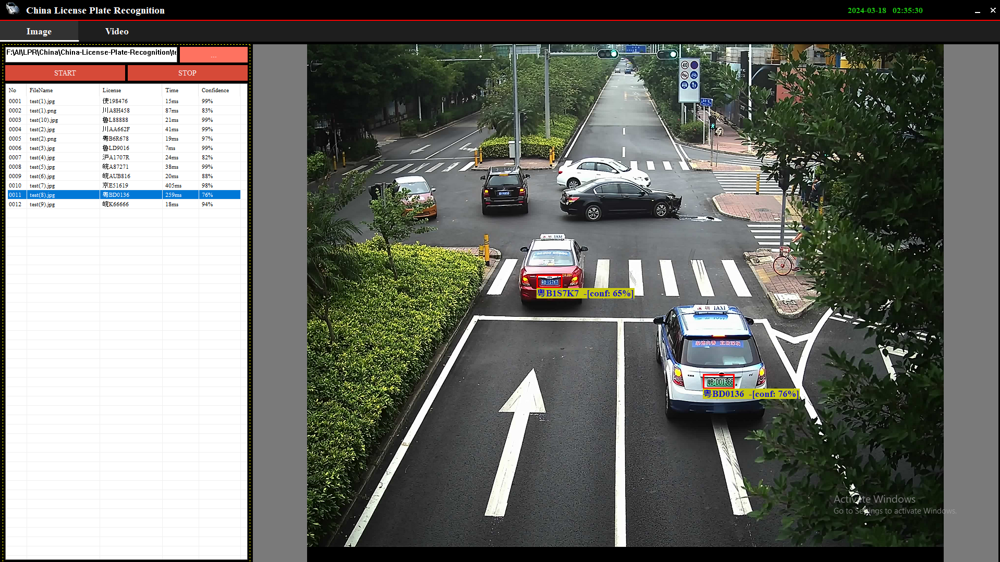

# China License Plate Recognition
This is the Costa Rica license plate recognition project in vs2022.

## Prerequisites
- vs2022
- opencv490
- cximage

## Features

- License plate recognition engine was built in vs2022
- License plate recognition engine used MQDF neural network classifier.
- License Plate recognition engine was built in only C++ and didn't use any third-party libraries.
- Its accuracy is over 98%.

## Libraries
- [cximage](https://archive.org/download/third-party-libraries/cximage.zip)
- [opencv](https://archive.org/download/third-party-libraries/opencv.zip)

## Application 
- [China-License-Plate-Recognition](https://archive.org/download/china-license-plate-recognition/China-License-Plate-Recognition.zip)

